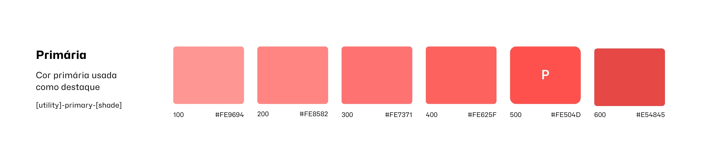
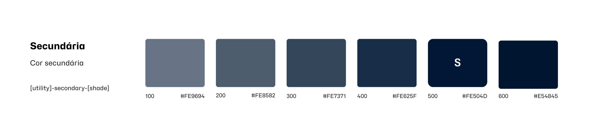
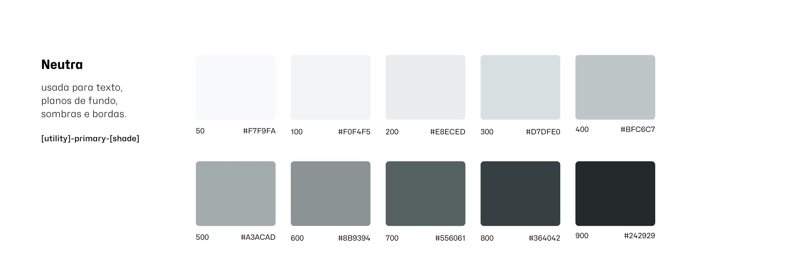
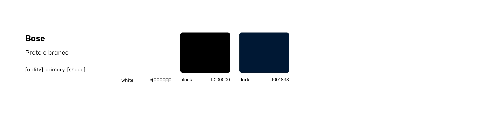

# Documentação de cores e diretrizes de uso

Use esta documentação como um guia para o uso adequado das cores Base39.

**Índice**
- [Documentação de cores e diretrizes de uso](#documentação-de-cores-e-diretrizes-de-uso)
  - [Primária](#primária)
  - [Secundária](#secundária)
  - [Neutras](#neutras)
  - [Base colors](#base-colors)

---

## Primária

A cor primária da nossa marca representa nosso desejo de inovação.

| Nome da cor | Hex |
| --- | --- |
| `primary-600` | #E54845 |
| `primary-500` | #FE504D |
| `primary-400` | #FE625F |
| `primary-300` | #FE7371 |
| `primary-200` | #FE8582 |
| `primary-100` | #FE9694 |

---

## Secundária

Essa cor secundária promove a importância da confiança e da transparência.

| Nome da cor | Hex |
| --- | --- |
| `secondary-600` | #00162E |
| `secondary-500` | #001833 |
| `secondary-400` | #192F47 |
| `secondary-300` | #33465C |
| `secondary-200` | #4D5D70 |
| `secondary-100` | #667485 |

---

## Neutras

Essa paleta de cores é usada para cores de texto, planos de fundo, sombras, bordas e sombreamento.

| Nome da cor | Hex |
| --- | --- |
| `gray-900` | #242929 |
| `gray-800` | #364042 |
| `gray-700` | #556061 |
| `gray-600` | #8B9394 |
| `gray-500` | #A3ACAD |
| `gray-400` | #BFC6C7 |
| `gray-300` | #D7DFE0 |
| `gray-200` | #E8ECED |
| `gray-100` | #F0F4F5 |
| `gray-50` | #F7F9FA |

---

## Base colors

Essas cores básicas são incluídas para cores de texto e planos de fundo.

| Nome da cor | Hex |
| --- | --- |
| `white` | #FFFFFF |
| `black` | #000000 |
| `dark` | #001833 |

[<-- Voltar a home do Brand Guideline](/brand-guidelines/README.md)