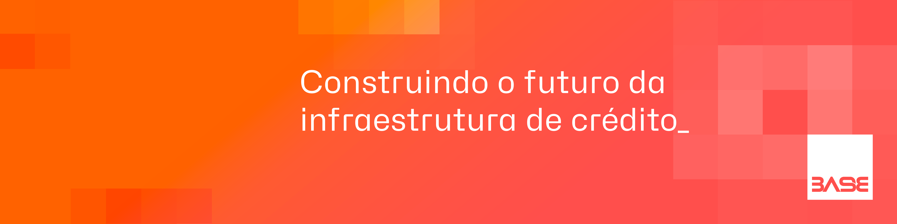

# LinkedIn personalizado
Use esta documentação como um guia para o uso adequado da capa Base39 e foto do perfil.

**Índice**
- [LinkedIn personalizado](#linkedin-personalizado)
  - [Capa do perfil](#capa-do-perfil)
  - [Foto do perfil](#foto-do-perfil)

---

## Capa do perfil

A capa é o primeiro contato que as pessoas têm com o seu perfil, e é uma ótima chance de mostrar sua personalidade e profissionalismo.

Além disso, a capa padrão ajuda a manter a coesão do nosso time e a fortalecer a nossa marca. Quando as pessoas olham os perfis dos membros do nosso time, eles devem conseguir identificar rapidamente que a gente pertence à mesma empresa. Isso é super importante quando a gente está tentando se conectar com possíveis clientes ou parceiros.

Atualmente temos um modelo de capa disponível. Siga o repositório para receber notificações de novos modelos de capa.

| Baixar capa | [PNG](./assets/covers/base39-cover-2023-01.png)

## Foto do perfil
Sempre priorize o uso do logo em `Red Orange Juice`. É isso que torna nosso logo reconhecível à primeira vista.

1. Acesse [Profile Pic Maker](https://pfpmaker.com/)
2. Faça upload da sua foto
3. Clique no ícone da gota, segunda aba (seta 1)
4. Clique na aba RGB (seta 2)
5. Use a cor `#FE504D` (seta 3)
6. Agora é só fazer download da primeira imagem no formato QUADRADO (também existe a opção com recorte em um círculo)

---

[<-- Voltar a home do Brand Guideline](/brand-guidelines/README.md)