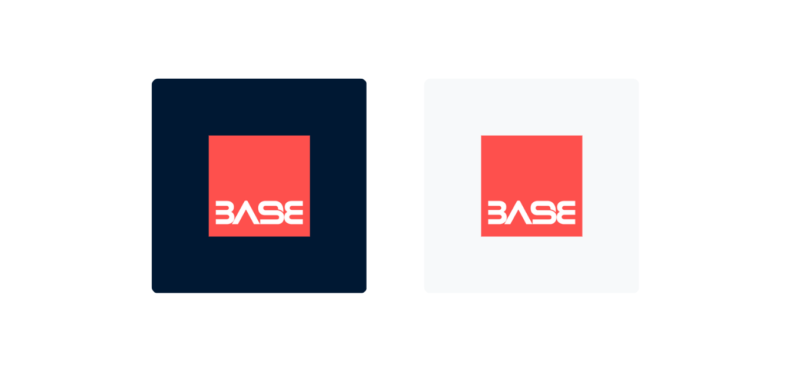
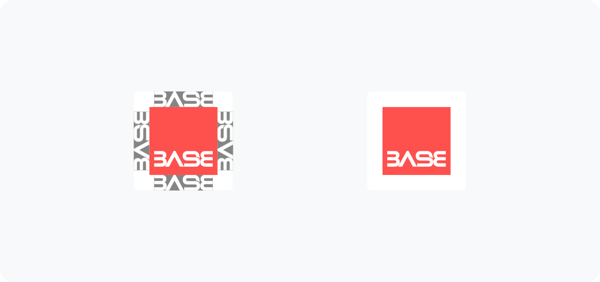
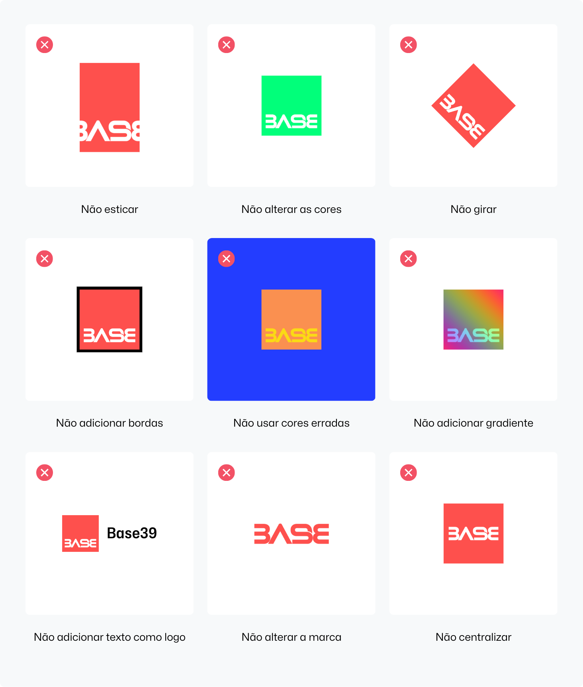

# Documentação de logo e diretrizes de uso
Use esta documentação como um guia para o uso adequado dos logos Base39.

**Índice**
- [Documentação de logo e diretrizes de uso](#documentação-de-logo-e-diretrizes-de-uso)
  - [Baixar kit de logos](#baixar-kit-de-logos)
  - [Uso geral do logo](#uso-geral-do-logo)
    - [Logo primário](#logo-primário)
    - [Logo branco](#logo-branco)
  - [Espaçamento](#espaçamento)
  - [Não faça](#não-faça)

---

## Baixar kit de logos
Você pode baixar todos os logos Base39 do diretório [/logos/base39](/logos/base39/) deste repositório. Consulte as diretrizes abaixo para o uso adequado dos logotipos.

## Uso geral do logo
Veja o gráfico abaixo para o uso recomendado de todos os estilos do logo Base39.

| Uso | Descrição |
| --- | --- |
| Altura e largura mínima | 42px |
| Preenchimento mínimo (espaço ao redor do logotipo) | 20px | 1.25rem |

---

### Logo primário
Para uso em interfaces de visual claro ou escuro e fundos claros ou escuros.

| Especificação | Descrição |
| --- | --- |
| Cor do fundo | [`white`](../color/README.md/#base-colors) / [`gray-50`](../color/README.md/#gray-neutrals) / [`dark`](../color/README.md/#base-colors) |
| Estilo do logo | Primary |
| Baixar | [SVG](/logos/base39/full-logo/primary/SVG/base39-logo--primary.svg), [PNG](/logos/base39/full-logo/primary/PNG/base39-logo--primary.png), [EPS](/logos/base39/full-logo/primary/EPS/base39-logo--primary_RGB.eps) |

---

### Logo branco
Logotipo alternativo para uso em planos de fundo gradientes e planos de fundo padronizados/texturizados.

| Especificação | Descrição |
| --- | --- |
| Cor do fundo | texturas / colorido |
| Estilo do logo | [`white`](../color/README.md/#base-colors) |
| Baixar | [SVG](/logos/base39/full-logo/white/SVG/base39-logo--white.svg), [PNG](/logos/base39/full-logo/white/PNG/base39-logo--white.png), [EPS](/logos/base39/full-logo/white/EPS/base39-logo--white_RGB.eps) |

---

## Espaçamento
**Espaço livre** neste contexto significa o espaço mínimo necessário ao redor do logotipo Base39 quando ele é colocado próximo a bordas ou outros elementos. A imagem abaixo mostra como o espaço livre é definido. Ao dimensionar o logotipo para cima e para baixo, você deve sempre usar o novo tamanho do “BASE” como um guia para quanto espaço livre você precisará naquela implementação específica.

## Não faça
Use os exemplos abaixo para entender o que NÃO fazer ao usar o logotipo.

---

[<-- Voltar a home do Brand Guideline](/brand-guidelines/README.md)