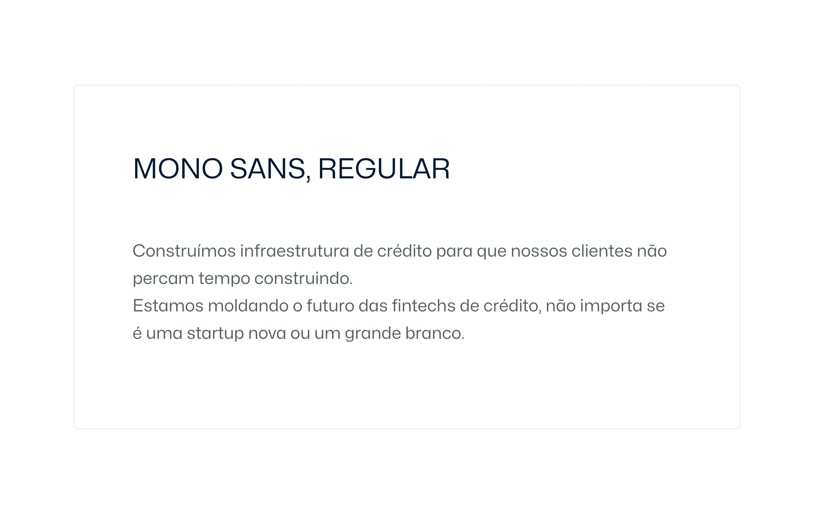

# Tipografia
Use esta documentação como um guia para o uso adequado da tipografia Base39.

**Índice**
- [Tipografia](#tipografia)
  - [Fontes](#fontes)
    - [Mona Sans](#mona-sans)
    - [Hubot Sans](#hubot-sans)
  - [Títulos](#títulos)
  - [Parágrafos](#parágrafos)
  - [Emparelhamento](#emparelhamento)
    - [Especificações de títulos](#especificações-de-títulos)
    - [Especificações de subtítulo](#especificações-de-subtítulo)
    - [Especificações de parágrafos](#especificações-de-parágrafos)

---

## Fontes
As fontes oficiais da Base39 também refletem nossa paixão tecnologia. Mona Sans & Hubot Sans são fontes open source criadas pelo Github. [Saiba mais.](https://github.com/mona-sans)

### Mona Sans

Uma tipografia forte e versátil, desenhada em conjunto com o [Degarism](https://degarism.com/) e inspirada nos grotescos da era industrial. Mona Sans funciona bem em produtos, web e impressão. Feito para funcionar bem junto com o ajudante da Mona Sans, Hubot Sans.

Mona Sans é uma fonte variável. As fontes variáveis permitem que diferentes variações de um tipo de letra sejam incorporadas em um único arquivo e são suportadas por todos os principais navegadores, permitindo benefícios de desempenho e controle de design granular do peso, largura e inclinação do tipo de letra.

[Baixar Mona Sans](https://github.com/github/mona-sans)

### Hubot Sans

Hubot Sans é o ajudante robótico da Mona Sans. A fonte foi projetada com detalhes mais geométricos para dar um toque técnico e idiossincrático – perfeito para cabeçalhos e citações. Feito em conjunto com a [Degarism](https://degarism.com/).

Hubot Sans é uma fonte variável. As fontes variáveis permitem que diferentes variações de um tipo de letra sejam incorporadas em um único arquivo e são suportadas por todos os principais navegadores.

[Baixar Hubot Sans](https://github.com/github/hubot-sans)

---

## Títulos
Os títulos são usados para declarações ousadas que não queremos que ninguém perca. Nossa escala de tamanho de título usa tamanhos de pixel em múltiplos de 4. Siga o guia de especificações abaixo para garantir que seus títulos correspondam à marca Base39 em qualquer tamanho.

| Parâmetro | Valor |
| --- | --- |
| `font-family` | “Hubot Sans”, sans-serif |
| `font-weight` | `700` (Bold), `600`(SemiBold) |
| `color` (default) | `dark` |
| `letter-spacing` | -0.03em |
| `line-height` | 1.125em |

---

## Parágrafos
Use as seguintes especificações para parágrafos em qualquer escala.

| Parâmetro | Valor |
| --- | --- |
| `font-family` | "Hubot Sans", sans-serif |
| `font-size` | > 14px |
| `font-weight` | `400` (Regular) |
| `color` (default) | `gray-700` |
| `letter-spacing` | -0.01em |
| `line-height` | 1.625em |

---

## Emparelhamento
Abaixo está um exemplo de como títulos, subtítulos e texto de parágrafo podem ser emparelhados ou agrupados.

*Observação: a imagem acima não representa o texto em tamanho real e será redimensionada de acordo com a largura do navegador.

A seguir, listamos as especificações para o emparelhamento de tipografia acima:

### Especificações de títulos
| Parâmetro | Valor |
| --- | --- |
| `font-size` | 64px |
| `color` (fundo claro) | `dark` |
| `color` (fundo escuro) | `white` |

### Especificações de subtítulo
| Parâmetro | Valor |
| --- | --- |
| `font-size` | 36px |
| `color` (fundo claro) | `dark` |
| `color` (fundo escuro) | `gray-300` |

### Especificações de parágrafos
| Parâmetro | Valor |
| --- | --- |
| `font-size` | 18px |
| `color` (fundo claro) | `gray-700` |
| `color` (fundo escuro) | `gray-300` |

---

[<-- Voltar a home do Brand Guideline](/brand-guidelines/README.md)